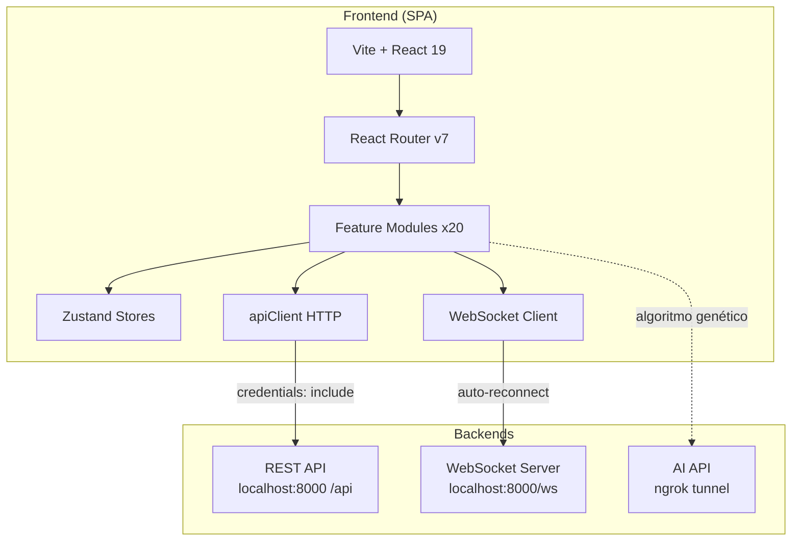

# Nich-Ká — Frontend Web

Plataforma web de **monitoreo en tiempo real de fermentación de café** mediante sensores IoT, algoritmos genéticos y aprendizaje automático. Dirigida a instituciones educativas en Latinoamérica.

> **Versión documentada:** `0.0.0` (según `package.json`).

---

## Índice de documentación

| Documento | Contenido |
|---|---|
| [docs/architecture.md](docs/architecture.md) | Arquitectura del sistema, capas, patrones de diseño y integraciones |
| [docs/project-structure.md](docs/project-structure.md) | Estructura de carpetas, organización por módulos y convenciones |
| [docs/installation.md](docs/installation.md) | Instalación local, variables de entorno y arranque del proyecto |
| [docs/deployment.md](docs/deployment.md) | Proceso de despliegue, CI/CD y configuración de producción |
| [docs/modules/auth.md](docs/modules/auth.md) | Módulo de autenticación (login, registro, OAuth, roles) |
| [docs/modules/dashboard.md](docs/modules/dashboard.md) | Módulo de dashboard y algoritmo genético |
| [docs/modules/sensors.md](docs/modules/sensors.md) | Módulo de sensores IoT y gráficas en tiempo real |
| [docs/modules/fermentation.md](docs/modules/fermentation.md) | Módulo de fermentación y reportes |
| [docs/modules/users.md](docs/modules/users.md) | Módulo de gestión de usuarios |
| [docs/modules/billing.md](docs/modules/billing.md) | Módulo de facturación y planes (Stripe/PayPal) |
| [docs/modules/chat.md](docs/modules/chat.md) | Módulo de chat AI (Nich-káBot) |
| [docs/modules/products.md](docs/modules/products.md) | Módulo de catálogo de productos |
| [docs/modules/support.md](docs/modules/support.md) | Módulo de soporte técnico |
| [docs/modules/messages.md](docs/modules/messages.md) | Módulo de mensajería entre usuarios |

---

## Descripción general

Nich-Ká Frontend es una aplicación SPA (Single Page Application) construida con React 19 y Vite que permite:

1. **Monitoreo en tiempo real** de sensores IoT (pH, temperatura, turbidez, conductividad, % de alcohol) mediante WebSocket.
2. **Configuración de experimentos** de algoritmos genéticos para optimizar parámetros de fermentación.
3. **Gestión de fermentaciones** con visualización de datos, reportes y calculadora de eficiencia.
4. **Plataforma educativa** con roles (admin, profesor, estudiante, soporte), grupos/clases y sistema de anuncios.
5. **Chat AI** integrado (Nich-káBot) para consultas sobre fermentación.
6. **Tienda de hardware** con carrito de compras y pasarela de pago (Stripe y PayPal).
7. **Sistema de soporte** con gestión de tickets y chat en tiempo real.

La aplicación se comunica con dos backends:
- **REST API** (`/api`) para operaciones CRUD, autenticación y datos históricos.
- **WebSocket** (`/ws/<path>`) para datos de sensores en tiempo real.
- **AI API** (ngrok) para algoritmos genéticos, experimentos y simulación.

---

## Inicio rápido

```bash
git clone https://github.com/ESTSOFTWARE/FERMENTADOR-WEB.git
cd FERMENTADOR-WEB

npm install
cp .env.example .env   # configurar variables de entorno

npm run dev            # http://localhost:3000
```

Guía completa en [docs/installation.md](docs/installation.md).

---

## Stack tecnológico

| Capa | Tecnologías |
|---|---|
| Framework | React 19, TypeScript 5.9, Vite 8 |
| Estilos | Tailwind CSS v4, shadcn/ui, Radix UI |
| Routing | React Router v7 |
| Estado | Zustand 5 (con persistencia) |
| Animaciones | Framer Motion, GSAP, Three.js |
| Gráficas | Recharts 3 |
| Pagos | Stripe, PayPal |
| Auth | Google OAuth, sesiones por cookie |
| PWA | vite-plugin-pwa (Workbox) |
| Build | Vite, TypeScript |

Ver dependencias completas en [docs/installation.md](docs/installation.md#dependencias).

---

## Diagrama de arquitectura



Ver diagrama completo en [docs/architecture.md](docs/architecture.md).

---

## Enlaces externos

- **Repositorio GitHub:** [ESTSOFTWARE/FERMENTADOR-WEB](https://github.com/ESTSOFTWARE/FERMENTADOR-WEB)
- **Backend API:** `https://backend.nich-ka.space/api`
- **Sitio web:** `https://www.nich-ka.space/`

