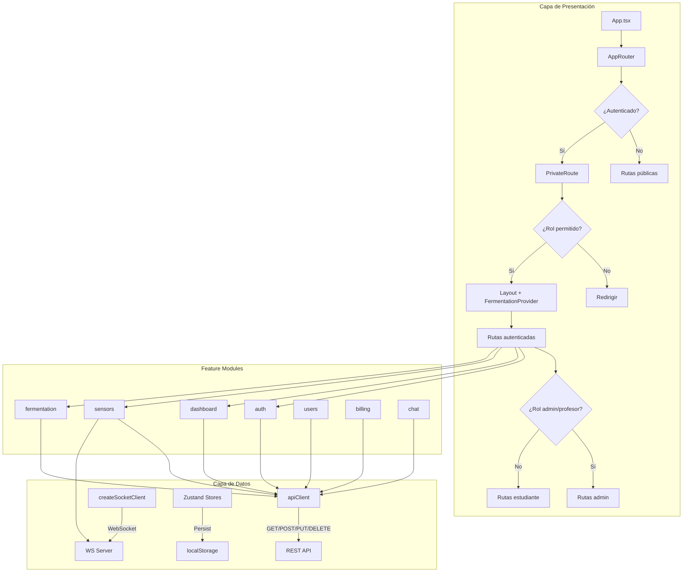
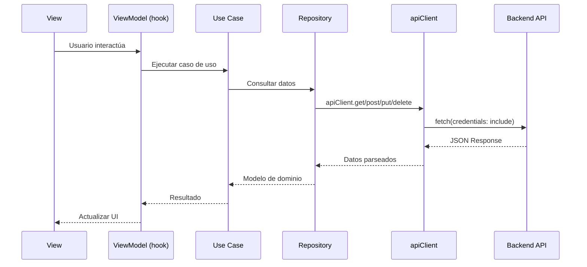
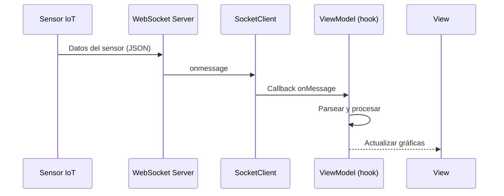
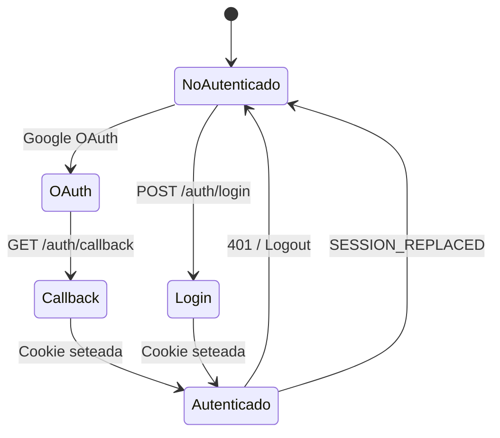

# Arquitectura del Sistema

Documentación técnica de la arquitectura de la aplicación web Nich-Ká Frontend.

---

## Visión general

Nich-Ká Frontend es una **SPA (Single Page Application)** construida con React 19, Vite y TypeScript. Sigue un patrón de **Arquitectura Limpia / Hexagonal** organizada por **features** (módulos de negocio), donde cada feature internamente aplica el patrón **MVVM** (Model-View-ViewModel).

---

## Patrón de arquitectura

### Arquitectura limpia por features

```
┌─────────────────────────────────────────────────┐
│                 PRESENTATION                     │
│  Views (páginas) + ViewModels (hooks lógica)    │
│  + Components (UI reutilizable) + Types          │
├─────────────────────────────────────────────────┤
│                  DOMAIN                          │
│  Models + Repository interfaces + Use Cases      │
├─────────────────────────────────────────────────┤
│                   DATA                           │
│  API services + Repository implementations       │
│  + DTOs + Mappers                                │
└─────────────────────────────────────────────────┘
```

Cada módulo feature es **autónomo** y contiene sus propias capas:

| Capa | Responsabilidad | Dependencias |
|---|---|---|
| **Domain** | Modelos, interfaces de repositorio, casos de uso. Lógica pura de negocio. | Ninguna (framework-agnostic) |
| **Data** | Implementaciones concretas de repositorios, llamadas HTTP, DTOs, mappers. | Depende de `core/network/client.ts` |
| **Presentation** | Vistas (páginas), ViewModels (custom hooks con lógica), componentes UI, tipos, constantes. | Depende de Domain y Data |

### Capa Core

Proporciona servicios transversales compartidos por todos los features:

```
core/
├── navigation/    # Enrutamiento, guards de rutas, protección por rol
├── network/       # Cliente HTTP (apiClient) y fábrica de WebSocket
├── store/         # Stores Zustand con persistencia
├── hooks/         # Hooks cross-cutting (auth, entitlements, notificaciones)
├── components/    # Componentes core (UserAvatar)
├── avatars/       # Definiciones de avatar
└── validation/    # Validadores de formularios
```

### Capa Shared

Componentes y utilidades compartidas entre features:

```
shared/
├── layout/        # Layout principal (sidebar + contenido)
├── components/    # Componentes reutilizables (NotifRow, PaginationBar, etc.)
├── presentation/  # NotFoundView (404)
├── animations/    # Variantes de animación Framer Motion
├── constants/     # IDs de tour, configuraciones de notificaciones
├── types/         # Tipos compartidos
└── utils/         # Formateo, linkify, notificaciones del navegador
```

---

## Diagrama de componentes



---

## Flujo de datos

### Flujo HTTP (REST API)



### Flujo WebSocket (datos en tiempo real)



---

## Sistema de autenticación

### Flujo de autenticación



### Mecanismos de auth

| Mecanismo | Detalle |
|---|---|
| **Sesión** | Cookie HTTP (credentials: 'include' en todas las requests) |
| **Token refresh** | Hook `useTokenRefresh` — auto-logout en 401 |
| **OAuth** | Google OAuth vía `@react-oauth/google` |
| **Persistencia** | `localStorage` almacena `user_data` y `profile_image` |
| **Sesión reemplazada** | Evento custom `SESSION_REPLACED` al detectar login en otro dispositivo |

### Control de acceso por roles

```
admin ─────────────── Todas las rutas
profesor ──────────── Rutas educativas + dashboard + experimentos
estudiante ────────── Rutas básicas (overview, sensores, chat, perfil)
soporte ───────────── Panel de soporte exclusivo
```

---

## Gestión de estado

### Zustand stores

| Store | Persistencia | Propósito |
|---|---|---|
| `useExperimentStore` | Sí (`fermest-store`) | ID de experimento/individuo actual, último resultado |
| `useCartStore` | No | Estado del carrito de compras |
| `useSupportStore` | No | Estado de tickets de soporte |
| `useSupportClientsStore` | No | Lista de clientes de soporte |

### Patrón de eventos custom

| Evento | Disparador | Consumidor |
|---|---|---|
| `session_expired` | `apiClient` (en 401) | `SessionWatcher` → redirige a `/login` |
| `user_data_updated` | Perfil de usuario | `useUserAuth` → sincroniza estado |

---

## Sistema de routing

### Tipos de rutas

| Tipo | Protección | Ejemplo |
|---|---|---|
| **Pública** | Ninguna | `/`, `/login`, `/products` |
| **Autenticada** | Cookie válida requerida | `/overview`, `/grafics`, `/chat` |
| **Admin/Profesor** | Rol `admin` o `profesor` | `/dashboard`, `/experiment/:id` |
| **Admin** | Solo rol `admin` | `/components` |
| **Soporte** | Solo rol `soporte` | `/support/*` |

### Componentes del router

| Componente | Función |
|---|---|
| `PrivateRoute` | Guard — redirige a `/login` si no autenticado, o a dashboard si rol no coincide |
| `ScrollToTop` | Scroll al inicio en cambio de ruta |
| `SessionWatcher` | Escucha evento `session_expired` y redirige |
| `PageTitle` | Actualiza `<title>` del documento |
| `FermentationProvider` | Context provider para estado de fermentación |

---

## Red y comunicación

### Cliente HTTP (`core/network/client.ts`)

- Wrapper de `fetch` con `VITE_API_URL` como base.
- Métodos: `get`, `post`, `put`, `patch`, `delete`, `upload` (FormData).
- Credentials: siempre `'include'` (cookie-based auth).
- Manejo global de 401: limpia storage, despacha evento `session_expired`.
- Header `ngrok-skip-browser-warning` para desarrollo con túneles ngrok.

### WebSocket Client (`core/network/createSocketClient.ts`)

- **Fábrica** — cada feature crea su propio cliente con `createSocketClient(path)`.
- **Auto-reconexión** con backoff exponencial (1s base, 15s máximo).
- **Timeout de conexión** de 8 segundos.
- **Path-based routing**: se conecta a `WS_BASE/ws/<path>`.
- **Estados**: `idle → connecting → connected → reconnecting → disconnected`.

### URLs de backend

| Servicio | Desarrollo | Producción |
|---|---|---|
| REST API | `http://localhost:8000/api` | `https://backend.nich-ka.space/api` |
| WebSocket | `ws://localhost:8000` | `wss://backend.nich-ka.space` |
| AI API | Túnel ngrok (cambia) | Túnel ngrok |

---

## Integraciones externas

### Servicios de terceros

| Servicio | Librería | Uso |
|---|---|---|
| **Google OAuth** | `@react-oauth/google` | Inicio de sesión con Google |
| **Stripe** | `@stripe/react-stripe-js`, `@stripe/stripe-js` | Pagos con tarjeta de crédito |
| **PayPal** | `@paypal/react-paypal-js` | Suscripciones y órdenes |
| **Vercel** | `vercel.json` | Hosting y despliegue |

### Backend REST API

El frontend se comunica con un backend FastAPI que expone endpoints bajo `/api`:
- Autenticación (`/auth/*`)
- Usuarios (`/users/*`)
- Sensores (`/sensors/*`)
- Fermentación (`/fermentation/*`)
- Facturación (`/billing/*`)
- Grupos (`/groups/*`)
- Y más...

## PWA (Progressive Web App)

Configurada con `vite-plugin-pwa`:

| Propiedad | Valor |
|---|---|
| Nombre | Nich-Ká |
| Tema | `#22C55E` (verde) |
| Fondo | `#0A0A0B` (oscuro) |
| Display | `standalone` |
| Idioma | `es` |
| Service Worker | Workbox (auto-update) |
| Caché | Fonts de Google (CacheFirst, 1 año) |

---

## Patrones de diseño utilizados

| Patrón | Uso en el proyecto |
|---|---|
| **Clean Architecture** | Separación Domain → Data → Presentation |
| **Feature-based modules** | Cada dominio de negocio es un módulo autónomo |
| **MVVM** | Views + ViewModels (custom hooks) + Components |
| **Repository Pattern** | Interfaces abstractas en Domain, implementaciones en Data |
| **Use Case Pattern** | Lógica de negocio encapsulada en casos de uso |
| **DTO Pattern** | Contratos de entrada/salida en boundary de API |
| **Factory Pattern** | `createSocketClient` — fábrica de clientes WebSocket |
| **Observer Pattern** | Listeners de mensajes y estado en WebSocket |
| **Provider Pattern** | React Context para fermentación y entitlements |
| **Custom Events** | Comunicación entre componentes no relacionados |
