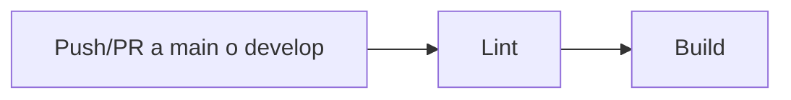
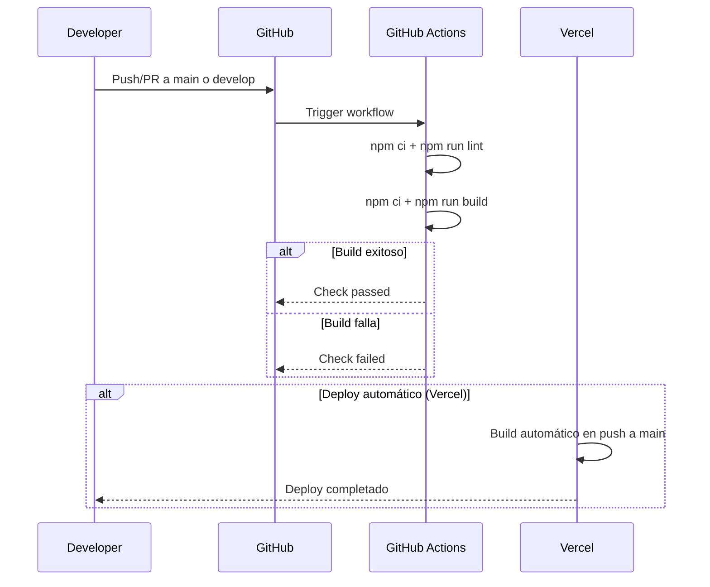

# Despliegue

Proceso de compilación, despliegue y CI/CD del proyecto.

---

## Resumen

| Aspecto | Detalle |
|---|---|
| **Plataforma de hosting** | Vercel |
| **CI/CD** | GitHub Actions |
| **Build command** | `tsc -b && vite build` |
| **Output directory** | `dist/` |
| **Node version (CI)** | 20 |
| **Branches activas** | `main`, `develop` |

---

## Despliegue en Vercel

### Configuración

El archivo `vercel.json` configura reescrituras SPA para que todas las rutas sirvan el `index.html`:

```json
{
  "rewrites": [
    { "source": "/(.*)", "destination": "/" }
  ]
}
```

Esto es necesario porque React Router maneja las rutas en el cliente.

### Configuración en Vercel Dashboard

| Setting | Valor |
|---|---|
| Framework Preset | Vite |
| Build Command | `npm run build` |
| Output Directory | `dist` |
| Install Command | `npm install` |
| Node.js Version | 20 |

### Variables de entorno en Vercel

Configurar en el dashboard de Vercel → Settings → Environment Variables:

| Variable | Entorno | Valor |
|---|---|---|
| `VITE_API_URL` | Production | `https://backend.nich-ka.space/api` |
| `VITE_WS_URL` | Production | `wss://backend.nich-ka.space` |
| `VITE_AI_API_URL` | Production | *(URL del túnel ngrok)* |
| `VITE_API_KEY_CHATBOT` | Production | *(API key del chatbot)* |
| `VITE_NAME_CHATBOT` | Production | `Nich-káBot` |
| `VITE_STRIPE_PUBLIC_KEY` | Production | *(Clave pública de Stripe producción)* |
| `VITE_PAYPAL_CLIENT_ID` | Production | *(Client ID de PayPal producción)* |

> **Importante:** Las variables `VITE_*` se incrustan en el bundle JavaScript del cliente durante el build. No son secretos.

---

## CI/CD con GitHub Actions

### Pipeline

Definido en `.github/workflows/ci.yml`:



### Triggers

| Evento | Branches |
|---|---|
| `push` | `main`, `develop` |
| `pull_request` | `main`, `develop` |

### Jobs

#### 1. `lint`

```yaml
steps:
  - Checkout
  - Setup Node.js 20
  - npm ci
  - npm run lint    # ESLint
```

#### 2. `build` (depende de `lint`)

```yaml
steps:
  - Checkout
  - Setup Node.js 20
  - npm ci
  - npm run build   # tsc -b && vite build
```

### Flujo completo



---

## Build local para producción

### Compilar

```bash
npm run build
```

Resultado en `dist/`:
```
dist/
├── index.html
├── assets/
│   ├── index-[hash].js
│   ├── index-[hash].css
│   └── ...
└── assets/
    ├── icon-192.png
    ├── icon-512.png
    └── ...
```

### Preview local del build

```bash
npm run preview
```

Sirve el build de producción en `http://localhost:4173`.

---

## Deploy manual (alternativo a Vercel)

Si se necesita deployar a otro servidor (nginx, Apache, etc.):

### Nginx example

```nginx
server {
    listen 80;
    server_name nich-ka.space;
    root /var/www/nich-ka-web/dist;
    index index.html;

    # SPA fallback
    location / {
        try_files $uri $uri/ /index.html;
    }

    # Cache de assets estáticos
    location /assets/ {
        expires 1y;
        add_header Cache-Control "public, immutable";
    }
}
```

### Docker (alternativo)

```dockerfile
FROM node:20 AS build
WORKDIR /app
COPY package*.json ./
RUN npm ci
COPY . .
RUN npm run build

FROM nginx:alpine
COPY --from=build /app/dist /usr/share/nginx/html
COPY nginx.conf /etc/nginx/conf.d/default.conf
EXPOSE 80
```

---

## Entornos

| Entorno | URL | API URL | Branch |
|---|---|---|---|
| **Desarrollo** | `http://localhost:3000` | `http://localhost:8000/api` | `develop` |
| **Staging** | *(Vercel preview)* | `https://backend.nich-ka.space/api` | PRs a `main` |
| **Producción** | `https://www.nich-ka.space` | `https://backend.nich-ka.space/api` | `main` |

---

## Monitoreo post-deploy

### Verificaciones manuales

1. Abrir la URL de producción.
2. Verificar que el login funciona.
3. Verificar que los sensores conectan (WebSocket).
4. Verificar que el chatbot responde.
5. Verificar que los pagos funcionan (Stripe/PayPal sandbox).

### Logs de Vercel

Acceder a Vercel Dashboard → tu proyecto → Logs para ver:
- Build logs
- Function logs (si se usan API routes)
- Access logs

---

## Rollback

En caso de un deploy con errores:

1. Ir a Vercel Dashboard → Deployments.
2. Encontrar el último deployment funcional.
3. Click en los tres puntos → "Promote to Production".

---

## Seguridad

### Checklist pre-deploy

- [ ] No hay claves secretas en el código fuente
- [ ] `.env` no está commiteado
- [ ] Variables de entorno de producción configuradas en Vercel
- [ ] Claves de Stripe/PayPal son de producción (no sandbox)
- [ ] `ngrok-skip-browser-warning` solo se usa en desarrollo
- [ ] No hay console.logs sensibles en el código

### Headers de seguridad

Verificar que el backend configura los siguientes headers:
- `Content-Security-Policy`
- `X-Frame-Options: DENY`
- `X-Content-Type-Options: nosniff`
- `Strict-Transport-Security`
