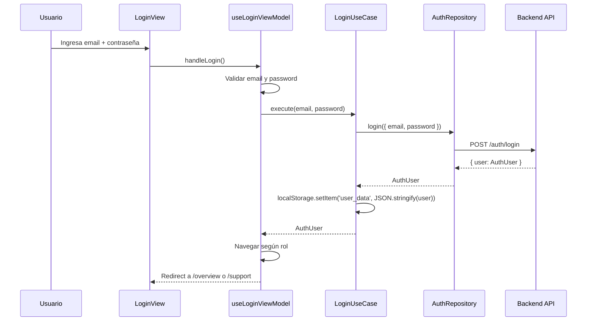
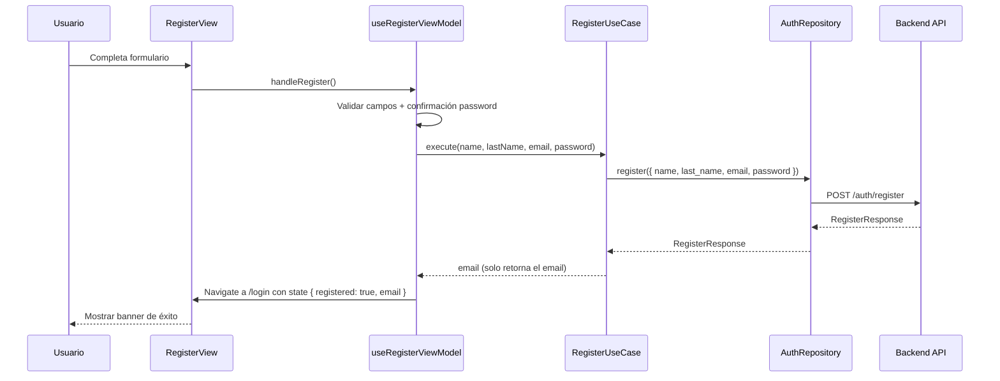
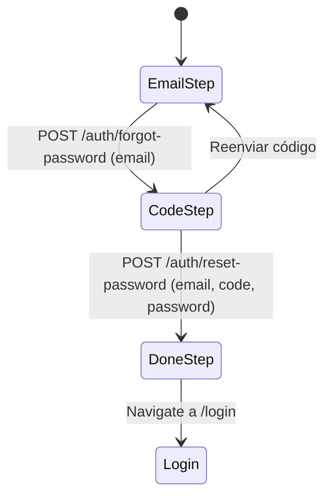
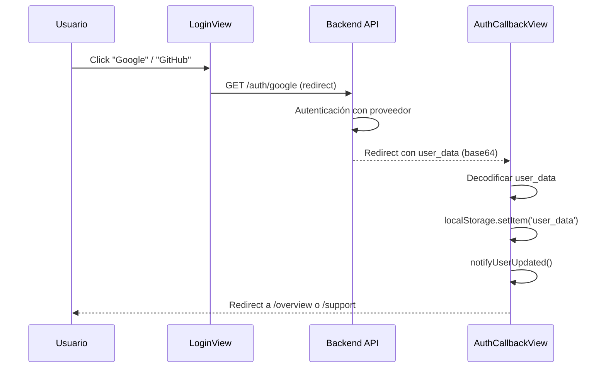
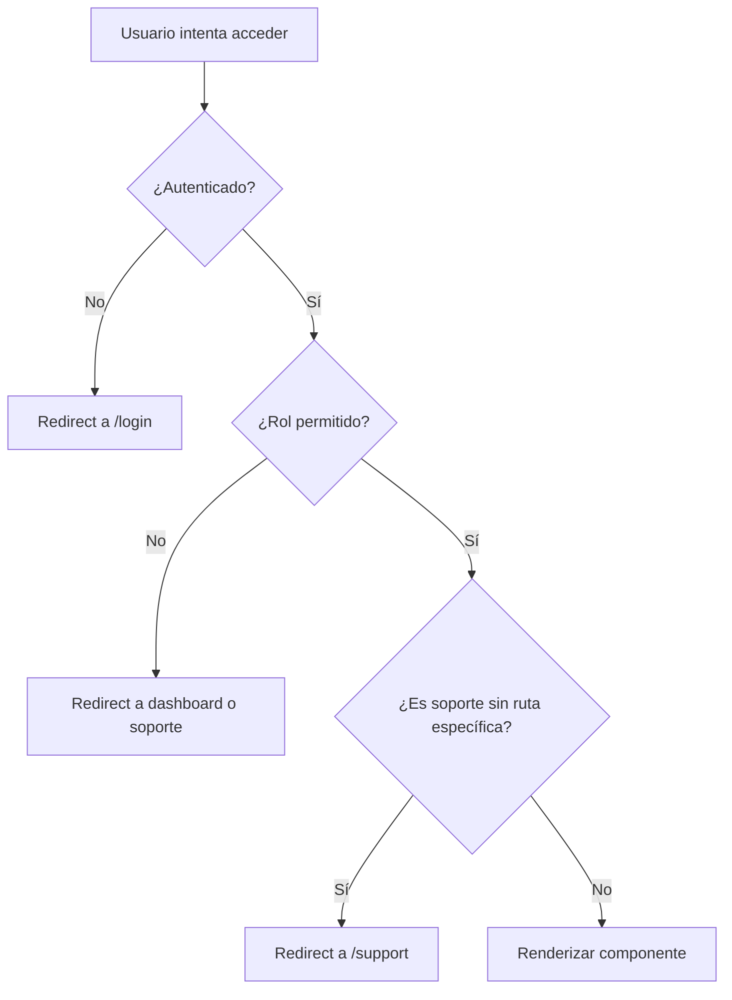

# Módulo de Autenticación (`auth`)

Gestión de login, registro, recuperación de contraseña, OAuth y control de sesiones.

---

## Descripción

El módulo `auth` maneja todo el ciclo de vida de la autenticación del usuario: inicio de sesión con email/password, registro de nuevos usuarios, recuperación de contraseña por código OTP, autenticación con Google/GitHub OAuth, y cierre de sesión.

---

## Estructura

```
features/auth/
├── data/
│   ├── api/
│   │   └── authApi.ts                    # Llamadas HTTP al backend
│   └── repositories/
│       └── AuthRepositoryImpl.ts         # Implementación del repositorio
├── domain/
│   ├── dtos/
│   │   ├── request/
│   │   │   ├── login.request.ts
│   │   │   ├── register.request.ts
│   │   │   ├── forgot-password.request.ts
│   │   │   ├── reset-password.request.ts
│   │   │   └── refresh-token.request.ts
│   │   └── response/
│   │       ├── access-token.response.ts
│   │       ├── message.response.ts
│   │       ├── register.response.ts
│   │       └── token.response.ts
│   ├── models/
│   │   └── Auth.ts                       # Modelo AuthUser
│   ├── repositories/
│   │   └── AuthRepository.ts             # Interfaz del repositorio
│   └── usecases/
│       ├── login.usecase.ts
│       ├── register.usecase.ts
│       ├── forgot-password.usecase.ts
│       ├── reset-password.usecase.ts
│       └── refresh-token.usecase.ts
└── presentation/
    ├── components/
    │   └── EyeIcon.tsx                   # Toggle de visibilidad de contraseña
    ├── constants/
    │   ├── auth-gallery.constants.ts     # Imágenes del panel lateral
    │   └── auth.variants.ts              # Variantes de animación
    ├── types/
    │   ├── forgot-password.types.ts
    │   └── register.types.ts
    ├── viewmodels/
    │   ├── useLoginViewModel.ts
    │   ├── useRegisterViewModel.ts
    │   └── useForgotPasswordViewModel.ts
    └── views/
        ├── Login.tsx
        ├── Register.tsx
        ├── ForgotPassword.tsx
        └── AuthCallbackView.tsx
```

---

## API Endpoints

| Método | Endpoint | Body | Respuesta | Descripción |
|---|---|---|---|---|
| `POST` | `/auth/login` | `LoginRequest` | `{ user: AuthUser }` | Iniciar sesión |
| `POST` | `/auth/register` | `RegisterRequest` | `RegisterResponse` | Registrar usuario |
| `POST` | `/auth/refresh` | *(ninguno)* | `MessageResponse` | Refrescar token |
| `POST` | `/auth/logout` | *(ninguno)* | `MessageResponse` | Cerrar sesión |
| `POST` | `/auth/forgot-password` | `ForgotPasswordRequest` | `MessageResponse` | Enviar código OTP |
| `POST` | `/auth/reset-password` | `ResetPasswordRequest` | `MessageResponse` | Restablecer contraseña |
| `GET` | `/auth/google` | *(redirect)* | *(HTML)* | Login con Google OAuth |
| `GET` | `/auth/github` | *(redirect)* | *(HTML)* | Login con GitHub OAuth |

---

## Modelo de datos

### `AuthUser`

```typescript
interface AuthUser {
  id:              number
  name:            string
  last_name:       string
  email:           string
  role:            string          // 'admin' | 'profesor' | 'estudiante' | 'soporte'
  circuit_id:      number | null
  profile_image:   string | null
  activation_code: string | null
  dial_code?:      string
  phone_number?:   string
  description?:    string | null
  tour_completed?: boolean
  oauth_provider?: 'google' | 'github' | 'email'
  created_at?:     string | null
}
```

### DTOs de solicitud

| DTO | Campos |
|---|---|
| `LoginRequest` | `email: string`, `password: string` |
| `RegisterRequest` | `name: string`, `last_name: string`, `email: string`, `password: string` |
| `ForgotPasswordRequest` | `email: string` |
| `ResetPasswordRequest` | `email: string`, `code: string`, `new_password: string` |

### DTOs de respuesta

| DTO | Campos |
|---|---|
| `MessageResponse` | `message: string` |
| `RegisterResponse` | `id: number`, `name: string`, `last_name: string`, `email: string`, `role: string` |

---

## Flujo de Login



---

## Flujo de Registro



---

## Flujo de Recuperación de Contraseña



### Wizard de 3 pasos

1. **Email**: El usuario ingresa su email. Se envía un código OTP de 6 dígitos.
2. **Código**: El usuario ingresa el código OTP + nueva contraseña + confirmación.
3. **Done**: Confirmación de éxito con enlace a login.

---

## Flujo OAuth



---

## Persistencia de sesión

| Mecanismo | Detalle |
|---|---|
| **Cookie HTTP** | El backend establece una cookie al hacer login. Todas las requests usan `credentials: 'include'`. |
| **localStorage** | `user_data` almacena el objeto `AuthUser` serializado. `profile_image` almacena la URL de la imagen. |
| **Syncronización** | Al cargar la app, `syncCurrentUser()` llama a `GET /users/me` para validar la cookie y sincronizar `localStorage`. |
| **Expiración** | Si el backend responde 401, `apiClient` limpia localStorage y despacha evento `session_expired`. |
| **Sesión reemplazada** | Si el backend retorna `SESSION_REPLACED`, se notifica al usuario que inició sesión en otro dispositivo. |

---

## Control de acceso

### Roles

| Role | Acceso |
|---|---|
| `admin` | Todas las rutas |
| `profesor` | Rutas educativas + dashboard + experimentos |
| `estudiante` | Rutas básicas (overview, sensores, chat, perfil) |
| `soporte` | Panel de soporte exclusivo (`/support/*`) |

### Guard de rutas (`PrivateRoute`)



---

## Componentes de UI

### Vistas

| Vista | Ruta | Función |
|---|---|---|
| `Login` | `/login` | Formulario de login + OAuth + banner de registro exitoso |
| `Register` | `/register` | Formulario de registro completo con validación |
| `ForgotPassword` | `/forgot-password` | Wizard de 3 pasos (email → código → done) |
| `AuthCallbackView` | `/auth/callback` | Manejo del redirect OAuth |

### Animaciones

- **Login/Registro/ForgotPassword**: Panel derecho con galería de imágenes de café con scroll automático y texto animado.
- **Transiciones**: Framer Motion con variantes `authPanelVariants` (staggered children) y `authItemVariants` (fade-in-up).

---

## Validación del lado del cliente

| Campo | Validador | Regla |
|---|---|---|
| Email | `v.email()` | Formato de email válido |
| Password (login) | `v.loginPassword()` | Mínimo 8 caracteres |
| Password (registro) | `v.password()` | Requisitos de seguridad |
| Confirm password | `v.matches(password)` | Debe coincidir con password |
| Nombre | `v.personName()` | Nombre válido |
| Términos | Checkbox | Debe aceptar para registrarse |

---

## Integración con otros módulos

| Módulo | Relación |
|---|---|
| `core/hooks/userAuth` | `useUserAuth()` provee estado de auth y `logout()` global |
| `core/network/client` | `apiClient` maneja 401 globalmente y dispara `session_expired` |
| `core/navigation/PrivateRoute` | Guard que protege rutas autenticadas |
| `core/navigation/SessionWatcher` | Escucha `session_expired` y redirige a `/login` |
| Todos los features | Consumen `useUserAuth()` para obtener el usuario actual |
