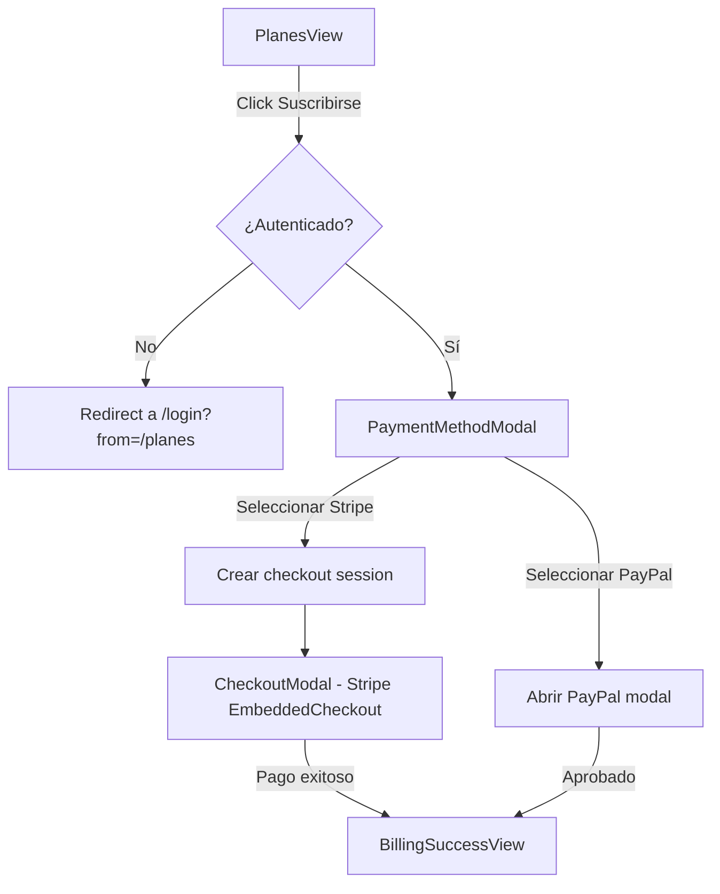

# Módulo de Facturación (`billing`)

Gestión de suscripciones, pagos con Stripe y PayPal, y control de features por plan.

---

## Descripción

El módulo `billing` maneja el ciclo de vida de suscripciones: selección de plan, checkout con Stripe (tarjeta) o PayPal (suscripción recurrente), confirmación de pago y control de features habilitadas por plan.

---

## Estructura

```
features/billing/
├── data/
│   ├── api/
│   │   └── billingApi.ts
│   └── repositories/
│       └── BillingRepositoryImpl.ts
├── domain/
│   ├── models/
│   │   └── Subscription.ts
│   ├── repositories/
│   │   └── BillingRepository.ts
│   └── usecases/
│       ├── create-checkout.usecase.ts
│       ├── create-paypal-subscription.usecase.ts
│       └── get-subscription.usecase.ts
└── presentation/
    ├── views/
    │   └── BillingSuccessView.tsx
    ├── viewmodels/
    │   └── usePlanesViewModel.ts
    └── components/
        ├── CheckoutModal.tsx
        ├── PaymentMethodModal.tsx
        ├── PayPalOrderModal.tsx
        └── PayPalSubscriptionModal.tsx
```

---

## API Endpoints

| Método | Endpoint | Body | Respuesta | Descripción |
|---|---|---|---|---|
| `POST` | `/billing/checkout` | `{ plan, billing_cycle }` | `CheckoutSession` | Crear sesión Stripe |
| `POST` | `/billing/paypal/subscription` | `{ plan, billing_cycle }` | `PayPalSubscriptionSession` | Crear suscripción PayPal |
| `GET` | `/billing/paypal/client-token` | — | `PayPalClientToken` | Token para hosted fields |
| `POST` | `/billing/paypal/order` | `{ amount, currency, description }` | `PayPalOrderResult` | Crear orden PayPal |
| `POST` | `/billing/paypal/order/{id}/capture` | `{}` | `object` | Capturar orden PayPal |
| `GET` | `/billing/subscription` | — | `Subscription \| null` | Suscripción actual |
| `DELETE` | `/billing/subscription` | — | `void` | Cancelar suscripción |
| `GET` | `/billing/entitlements` | — | `Entitlements` | Features por plan |

---

## Planes de precio

| Plan | Key | Mensual | Anual | Ahorro anual |
|---|---|---|---|---|
| Starter | `starter` | $49 USD/mo | $490 USD/yr | ~17% |
| Academic | `academic` | $129 USD/mo | $1,290 USD/yr | ~17% |
| Enterprise | `enterprise` | $299 USD/mo | $2,990 USD/yr | ~17% |

---

## Entitlements (features por plan)

```typescript
interface Entitlements {
  plan:         string          // 'free' | 'starter' | 'academic' | 'enterprise'
  features:     string[]        // ['sensors', 'start_fermentation', 'reports', ...]
  max_circuits: number | null   // null = ilimitado
}
```

El hook `useEntitlements` (en `core/hooks/`) llama a `GET /billing/entitlements` y expone `hasFeature(name)` para verificar si una feature está habilitada en el plan actual.

---

## Flujo de pago

### Selección de plan



### Pago con Stripe

1. `PaymentMethodModal` → usuario selecciona "Tarjeta de crédito/débito"
2. `POST /billing/checkout` → obtiene `client_secret`
3. `CheckoutModal` renderiza `<EmbeddedCheckout />` de Stripe
4. Stripe procesa la tarjeta (incluye 3D Secure)
5. Redirect a `/billing/success`

### Pago con PayPal (suscripción recurrente)

1. `PaymentMethodModal` → usuario selecciona PayPal
2. `PayPalSubscriptionModal` se abre con plan y ciclo
3. `POST /billing/paypal/subscription` → obtiene `subscription_id`
4. PayPal SDK muestra popup de consentimiento
5. On approve → redirect a `/billing/success?provider=paypal`

---

## Modelo de suscripción

```typescript
interface Subscription {
  plan:                   string   // 'starter' | 'academic' | 'enterprise'
  billing_cycle:          string   // 'monthly' | 'annual'
  status:                 string   // 'active' | 'past_due' | 'canceled' | 'incomplete'
  current_period_end:     string | null
  cancel_at_period_end:   boolean
  payment_provider?:      string   // 'stripe' | 'paypal'
  paypal_subscription_id?: string | null
}
```

---

## Vistas y componentes

### `BillingSuccessView` — Confirmación de pago

- Ruta: `/billing/success` (pública)
- Checkmark verde animado, "¡Pago exitoso!"
- Countdown de 5 segundos a `/overview`
- Botón "Ir al dashboard" para navegación inmediata
- Recibe `?provider=paypal|stripe` como query param

### `PaymentMethodModal` — Selector de método de pago

- Dialog con 2 opciones: Stripe (tarjeta) y PayPal (saldo/tarjeta vinculada)
- Logo de cada proveedor + descripción
- Spinner en botón de Stripe mientras se crea la sesión

### `CheckoutModal` — Checkout de Stripe

- Modal con `<EmbeddedCheckout />` de Stripe
- Header con logo Nich-Ká
- Maneja tarjeta, 3D Secure, todo dentro del iframe de Stripe

### `PayPalSubscriptionModal` — Suscripción PayPal

- Resumen del plan con precio
- Botones `<PayPalButtons>` con `label: 'subscribe'`
- Configurado con `vault: true`, `intent: 'subscription'`

### `PayPalOrderModal` — Pago único con tarjeta vía PayPal

- Formulario de tarjeta usando PayPal Hosted Fields
- Campos: número de tarjeta, fecha de expiración, CVV
- **Nota**: Componente disponible pero no consumido actualmente por ninguna vista

---

## Variables de entorno requeridas

| Variable | Propósito |
|---|---|
| `VITE_STRIPE_PUBLIC_KEY` | Clave pública de Stripe (publishable key) |
| `VITE_PAYPAL_CLIENT_ID` | Client ID de PayPal |

---

## Integración con otros módulos

| Módulo | Relación |
|---|---|
| `landing` | `PlanesView` muestra precios y renderiza modales de billing |
| `core/hooks/useEntitlements` | Gatea features según el plan activo |
| `users` | Verifica plan enterprise para crear admin |
| `profile` | Muestra información de suscripción actual |
