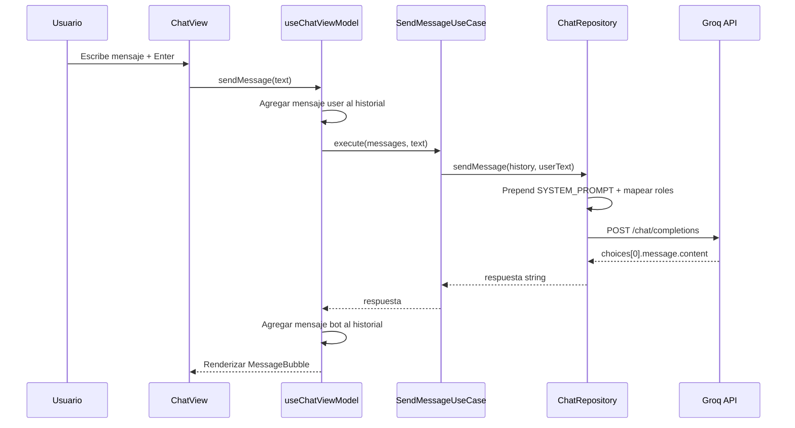

# Módulo de Chat (`chat`)

Chat AI integrado (Nich-káBot) para consultas sobre fermentación de café.

---

## Descripción

El módulo `chat` provee un chatbot conversacional especializado en fermentación de café. Usa la API de Groq con el modelo `llama-3.1-8b-instant` y un system prompt personalizado que restringe las respuestas a temas de fermentación, sensores IoT y la plataforma Nich-Ká.

---

## Estructura

```
features/chat/
├── data/
│   ├── api/
│   │   └── chatApi.ts                      # Llamada a API de Groq
│   └── repositories/
│       └── ChatRepositoryImpl.ts
├── domain/
│   ├── dtos/
│   │   ├── request/
│   │   │   └── chat-completion.request.ts
│   │   └── response/
│   │       └── chat-completion.response.ts
│   ├── models/
│   │   └── Message.ts
│   ├── repositories/
│   │   └── ChatRepository.ts
│   └── usecases/
│       └── send-message.usecase.ts
└── presentation/
    ├── components/
    │   ├── ChatEmptyState.tsx
    │   ├── ChatHeader.tsx
    │   ├── ChatInput.tsx
    │   ├── MessageBubble.tsx
    │   └── TypingIndicator.tsx
    ├── constants/
    │   └── chat.constants.ts
    ├── types/
    │   └── *.types.ts
    ├── view/
    │   └── ChatView.tsx
    └── viewmodels/
        └── useChatViewModel.ts
```

---

## API

| Detalle | Valor |
|---|---|
| **Proveedor** | Groq (compatible con OpenAI API) |
| **URL** | `https://api.groq.com/openai/v1/chat/completions` |
| **Método** | `POST` |
| **Modelo** | `llama-3.1-8b-instant` |
| **Auth** | Bearer token (`VITE_API_KEY_CHATBOT`) |

### Request

```json
{
  "model": "llama-3.1-8b-instant",
  "messages": [
    { "role": "system", "content": "<SYSTEM_PROMPT>" },
    { "role": "user", "content": "..." },
    { "role": "assistant", "content": "..." },
    { "role": "user", "content": "nuevo mensaje" }
  ]
}
```

### Response

```json
{
  "choices": [{ "message": { "content": "respuesta del bot" } }]
}
```

### Errores

| HTTP | Error | Mensaje al usuario |
|---|---|---|
| 429 | Rate limit | "Límite de solicitudes alcanzado. Espera un momento e intenta de nuevo." |
| Otro | Conexión | "Error de conexión. Verifica tu red e intenta de nuevo." |

---

## System Prompt

El bot se identifica como **Nich-káBot** (configurable via `VITE_NAME_CHATBOT`) y sigue estas reglas:

1. **Solo responde** sobre: fermentación de café, pH, tiempo de fermentación, perfiles de sabor, procesamiento húmedo/seco, microbiología de fermentación, sensores IoT, algoritmos genéticos para café, uso de la plataforma Nich-Ká.
2. **Fuera de scope**: responde *"Solo puedo ayudarte con temas relacionados a la fermentación de café y la plataforma Nich-Ká."*
3. Siempre responde en **español**.
4. Respuestas concisas y técnicas.

---

## Modelo de datos

### `Message`

```typescript
type Message = {
  role: 'user' | 'model'   // 'model' se mapea a 'assistant' para la API
  text: string
}
```

### DTOs

| DTO | Campos |
|---|---|
| `ChatCompletionRequest` | `model: string`, `messages: Array<{ role, content }>` |
| `ChatCompletionResponse` | `choices: Array<{ message: { content } }>`, `error?: { message }` |

---

## Flujo de聊天



---

## Vistas y componentes

### `ChatView` — Página principal

- Ruta: `/chat` (autenticado)
- Layout: header + área scrollable de mensajes + input fijo abajo
- Altura: `calc(100vh - 3.5rem)` (full height menos sidebar)
- Auto-scroll al último mensaje
- Integración con Lenis (smooth scroll)

### `ChatHeader` — Cabecera

- Logo del bot, nombre (`BOT_NAME`), subtítulo "Asistente de fermentación de café"
- Indicador verde pulsante "En línea"

### `ChatInput` — Input de mensajes

- Textarea auto-growing (max 160px)
- Botón de enviar (flecha verde)
- Enter envía, Shift+Enter nueva línea
- Hint: "Solo responde temas de fermentación de café"
- Deshabilitado cuando está vacío o cargando

### `ChatEmptyState` — Estado vacío

- Logo, "¿En qué te puedo ayudar?", descripción
- 3 botones de sugerencia:
  - "¿Qué pH es ideal para fermentar café?"
  - "¿Cómo afecta la temperatura al perfil de sabor?"
  - "¿Cuánto tiempo dura la fermentación?"

### `MessageBubble` — Burbuja de mensaje

- Usuario: alineado a la derecha, estilo verde
- Bot: alineado a la izquierda, logo + estilo neutro
- Max-width: 70%

### `TypingIndicator` — Indicador de escritura

- Logo del bot + 3 puntos verdes rebotantes (animación staggered)

---

## Variables de entorno requeridas

| Variable | Propósito |
|---|---|
| `VITE_API_KEY_CHATBOT` | Token de autenticación de Groq API |
| `VITE_NAME_CHATBOT` | Nombre del bot en la UI (default: "Nich-káBot") |

---

## Integración con otros módulos

| Módulo | Relación |
|---|---|
| `core/hooks/userAuth` | Verifica autenticación |
| `landing` | El nombre del bot se muestra en la landing page |
