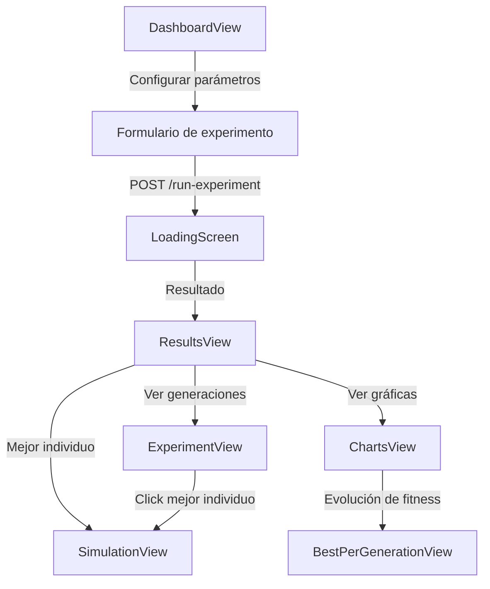

# Módulo de Dashboard y Algoritmo Genético (`dashboard`)

Configuración, ejecución y visualización de experimentos de algoritmo genético para optimización de parámetros de fermentación.

---

## Descripción

El módulo `dashboard` permite a administradores y profesores configurar y ejecutar experimentos de optimización usando algoritmos genéticos (AG). El AG optimiza parámetros operacionales del bioreactor (RPM, temperatura, flujo) para maximizar la producción de etanol y eficiencia de conversión.

---

## Estructura

```
features/dashboard/
├── data/
│   ├── api/
│   │   └── experimentApi.ts              # Llamadas HTTP a la API de IA
│   └── repositories/
│       └── ExperimentRepositoryImpl.ts    # Implementación del repositorio
├── domain/
│   ├── dtos/
│   │   ├── request/
│   │   │   └── run-experiment.request.ts
│   │   └── response/
│   │       ├── best-generation.response.ts
│   │       ├── best-individual.response.ts
│   │       ├── best-per-generation-result.response.ts
│   │       ├── experiment-result.response.ts
│   │       └── run-experiment.response.ts
│   ├── models/
│   │   ├── Experiment.ts
│   │   ├── Generation.ts
│   │   ├── Individual.ts
│   │   └── Simulation.ts
│   ├── repositories/
│   │   └── ExperimentRepository.ts
│   └── usecases/
│       ├── get-best-per-generation.usecase.ts
│       ├── get-experiment.usecase.ts
│       ├── get-simulation.usecase.ts
│       └── run-experiment.usecase.ts
└── presentation/
    ├── components/
    │   ├── ExperimentSummary.tsx
    │   ├── LoadingScreen.tsx
    │   ├── MicroorganismSelector.tsx
    │   └── ParameterSlider.tsx
    ├── constants/
    │   ├── agdMessages.ts
    │   ├── chart.constants.ts
    │   ├── fields.ts
    │   ├── loading-screen.constants.ts
    │   └── microorganisms.ts
    ├── types/
    │   └── *.types.ts
    ├── view/
    │   ├── DashboardView.tsx
    │   ├── ExperimentView.tsx
    │   ├── BestPerGenerationView.tsx
    │   ├── ChartsView.tsx
    │   ├── ResultsView.tsx
    │   └── SimulationView.tsx
    └── viewmodels/
        ├── useDashboardViewModel.ts
        ├── useExperimentViewModel.ts
        └── useSimulationViewModel.ts
```

---

## API Endpoints

Todos los endpoints apuntan a `VITE_AI_API_URL` (servicio de ML vía ngrok).

| Método | Endpoint | Body | Respuesta | Descripción |
|---|---|---|---|---|
| `POST` | `/run-experiment` | `RunExperimentRequest` | `RunExperimentResponse` | Ejecutar experimento de AG |
| `GET` | `/experiment/{id}` | — | `ExperimentResult` | Obtener experimento + generaciones |
| `GET` | `/simulation/{id}` | — | `Simulation` | Curvas de simulación de un individuo |
| `GET` | `/experiment/{id}/best-per-generation` | — | `BestPerGenerationResult` | Mejor/peor/promedio por generación |

---

## Modelos de dominio

### `Experiment`

```typescript
interface Experiment {
  id:          string
  ph:          number
  temperature: number
  sugar:       number
}
```

### `Individual` (solución candidata del AG)

```typescript
interface Individual {
  id:          string
  rpm:         number      // Velocidad de agitación
  temperature: number
  flow:        number      // Flujo volumétrico
  fitness:     number      // Fitness del AG
  ethanol:     number      // Etanol producido (g/L)
  biomass:     number      // Biomasa final (g/L)
  substrate:   number      // Sustrato restante
  efficiency:  number      // Eficiencia de conversión
  energy:      number      // Energía consumida (Wh)
}
```

### `Generation`

```typescript
interface Generation {
  generation:   number
  best_fitness: number
  individuals:  Individual[]
}
```

### `Simulation` (curvas de fermentación)

```typescript
interface Simulation {
  time:      number[]
  biomass:   number[]
  substrate: number[]
  ethanol:   number[]
}
```

---

## DTOs

### Request

| DTO | Campos |
|---|---|
| `RunExperimentRequest` | `ph`, `temperature`, `sugar`, `microorganism` (string), `micro_amount` |

### Response

| DTO | Campos clave |
|---|---|
| `RunExperimentResponse` | `experiment_id`, `best_individual`, `history[]`, `history_worst[]`, `history_avg[]` |
| `ExperimentResult` | `experiment`, `generations[]` |
| `BestPerGenerationResult` | `experiment_id`, `generations[]` (con `best_individual` por generación) |

---

## Flujo de usuario



---

## Vistas

### `DashboardView` — Formulario de configuración

- Ruta: `/dashboard` (admin/profesor)
- Formulario con 4 sliders paramétricos (`ParameterSlider`) y selector de microorganismo
- Parámetros: pH (4-10), Temperatura (15-45°C), Azúcar (1-100 g/L), Cantidad de microorganismo (0.1-5)
- Microorganismos: `saccharomyces`, `kluyveromyces`, `zymomonas`
- Al enviar: ejecuta el AG → guarda resultado en Zustand store → redirige a `/results/:id`

### `ResultsView` — Resultados del experimento

- Ruta: `/results/:id`
- Lee datos del `useExperimentStore` (sin re-fetch)
- Muestra: 3 tarjetas resumen (total generaciones, mejora %, mejor generación)
- Panel izquierdo: métricas del mejor individuo (RPM, Temperatura, Flujo, Fitness, Etanol, Biomasa, Eficiencia, Energía)
- Panel derecho: gráfica de línea con historial de fitness (mejor/promedio/peor)
- Desglose energético con fórmulas: `pAgit`, `pBomb`, `pTemp`, `eX`

### `ExperimentView` — Navegador de generaciones

- Ruta: `/experiment/:id`
- Selector paginado de generaciones (botones "Gen 0", "Gen 1", ...)
- Grid 4 columnas de tarjetas `Individual` por generación
- Mejor individuo resaltado con borde verde y badge "Mejor"

### `ChartsView` — Análisis avanzado

- Ruta: `/experiment/:id/charts`
- 5 gráficas: evolución de fitness, parámetros del mejor individuo, scatter fitness vs RPM, scatter fitness vs Flow, evolución de población

### `SimulationView` — Curvas de fermentación

- Ruta: `/simulation/:id`
- Gráficas de Biomasa, Etanol y Sustrato vs tiempo
- Tarjetas resumen: tiempo total, biomasa final, etanol final, sustrato final

### `BestPerGenerationView` — Evolución por generación

- Ruta: `/experiment/:id/best-per-generation`
- 4 gráficas: Fitness, RPM, Temperatura, Flujo — todas vs generación

---

## Store global (`useExperimentStore`)

Almacenamiento Zustand con persistencia en localStorage (clave: `fermest-store`):

| Campo | Tipo | Propósito |
|---|---|---|
| `experimentId` | `string \| null` | ID del experimento actual |
| `individualId` | `string \| null` | ID del individuo seleccionado |
| `lastResult` | `RunExperimentResponse \| null` | Último resultado del AG |

Permite pasar datos entre vistas sin re-fetch (ej: `DashboardView` → `ResultsView`).

---

## Componentes reutilizables

| Componente | Función |
|---|---|
| `ParameterSlider` | Slider con +/- hold-to-repeat, input numérico y barra de progreso |
| `MicroorganismSelector` | Lista vertical de 3 opciones de microorganismo (radio style) |
| `ExperimentSummary` | Tarjeta resumen del formulario + botón "Ejecutar experimento" |
| `LoadingScreen` | Overlay de carga con spinner animado, mensajes rotativos y partículas |

---

## Constantes

| Constante | Contenido |
|---|---|
| `fields` | 4 definiciones de slider (ph, temperature, sugar, micro_amount) con min, max, step, unidad, ícono |
| `microorganisms` | 3 opciones: saccharomyces, kluyveromyces, zymomonas |
| `AGD_MESSAGES` | 12 mensajes en español rotativos durante la carga |
| `BUBBLES` | 18 objetos de estilo para animación de burbujas en loading |

---

## Integración con otros módulos

| Módulo | Relación |
|---|---|
| `core/store/useExperimentStore` | Comparte datos entre DashboardView y ResultsView |
| `sensors` | La simulación muestra datos que complementan los sensores en tiempo real |
| `fermentation-reports` | Los reportes de fermentación pueden referenciar experimentos |
