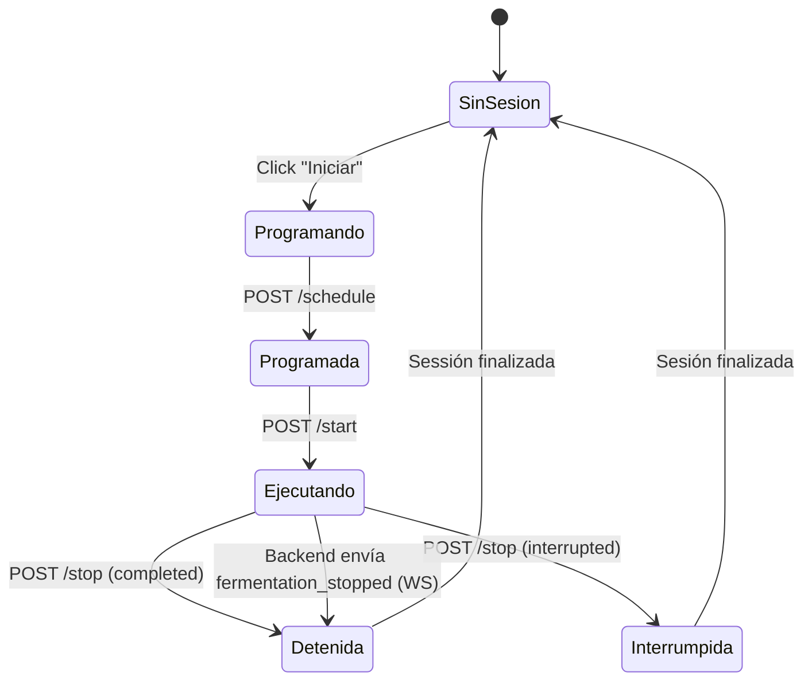

# Módulo de Fermentación (`fermentation`)

Gestión del ciclo de vida de fermentaciones: programación, inicio, monitoreo, control de sensores, predicción ML y reportes.

---

## Descripción

El módulo `fermentation` administra el proceso completo de fermentación de café: desde la programación con parámetros iniciales, pasando por el control en tiempo real de sensores y dispositivos, hasta la generación de reportes y predicciones de eficiencia mediante ML.

---

## Estructura

```
features/fermentation/
├── data/
│   ├── api/
│   │   └── fermentationApi.ts             # Endpoints REST
│   └── repositories/
│       └── FermentationRepositoryImpl.ts
├── domain/
│   ├── models/
│   │   ├── FermentationSession.ts
│   │   ├── FermentationStatus.ts
│   │   ├── FermentationReport.ts
│   │   ├── PredictionResult.ts
│   │   ├── ReportHistory.ts
│   │   ├── SensorControl.ts
│   │   └── SensorKey.ts
│   ├── dtos/
│   │   ├── request/
│   │   │   ├── schedule-fermentation.request.ts
│   │   │   └── stop-fermentation.request.ts
│   │   └── response/
│   │       ├── fermentation-session.response.ts
│   │       ├── fermentation-report.response.ts
│   │       └── report-history-item.response.ts
│   ├── repositories/
│   │   └── FermentationRepository.ts
│   └── usecases/
│       ├── get-active-session.usecase.ts
│       ├── schedule-fermentation.usecase.ts
│       ├── start-fermentation.usecase.ts
│       ├── stop-fermentation.usecase.ts
│       ├── get-fermentation-report.usecase.ts
│       ├── get-report-history.usecase.ts
│       └── request-prediction.usecase.ts
└── presentation/
    ├── context/
    │   ├── FermentationContext.ts
    │   └── FermentationProvider.tsx
    ├── hooks/
    │   └── useFermentation.ts
    ├── view/
    │   └── FermentationView.tsx
    ├── viewmodels/
    │   └── useFermentationViewModel.ts
    ├── components/
    │   ├── MainControlSection.tsx
    │   ├── SensorControlSection.tsx
    │   ├── ScheduleForm.tsx
    │   ├── ToggleSwitch.tsx
    │   └── StatusPill.tsx
    ├── types/
    │   └── *.types.ts
    ├── constants/
    │   ├── status-config.constants.ts
    │   ├── sensor-icons.constants.ts
    │   ├── sensor-controls.constants.ts
    │   └── schedule-form-styles.constants.ts
    └── utils/
        ├── to-device-state.ts
        ├── sensor-state-storage.ts
        └── get-sensor-icon.ts
```

---

## API Endpoints

| Método | Endpoint | Body | Respuesta | Descripción |
|---|---|---|---|---|
| `POST` | `/fermentation/schedule` | `ScheduleFermentationRequest` | `FermentationSession` | Programar fermentación |
| `POST` | `/fermentation/{id}/start` | — | `FermentationSession` | Iniciar fermentación |
| `POST` | `/fermentation/{id}/stop` | `{ interrupted: boolean }` | `FermentationSession` | Detener fermentación |
| `GET` | `/fermentation/active` | — | `FermentationSession \| null` | Obtener sesión activa |
| `GET` | `/fermentation/sessions` | — | `FermentationSession[]` | Historial de sesiones |
| `GET` | `/fermentation/sessions-with-reports` | — | `{ session, report }[]` | Sesiones con reportes |
| `GET` | `/fermentation/{id}/report` | — | `FermentationReport` | Obtener reporte |
| `GET` | `/fermentation/history` | — | `ReportHistory[]` | Historial de reportes |
| `POST` | `/fermentation/{id}/predict-now` | — | `PredictionResult` | Solicitar predicción ML |

---

## Modelos de dominio

### `FermentationSession`

```typescript
interface FermentationSession {
  id:               number
  circuit_id:       number
  user_id:          number
  group_id:         number | null
  formula_id:       number
  scheduled_start:  string
  scheduled_end:    string
  actual_start:     string | null
  actual_end:       string | null
  status:           FermentationStatus
  interrupted_by:   number | null
  created_at:       string | null
}
```

### `FermentationStatus`

```typescript
type FermentationStatus = 'scheduled' | 'running' | 'completed' | 'interrupted'
```

### `FermentationReport`

```typescript
interface FermentationReport {
  id:                    number
  session_id:            number
  initial_sugar:         number
  final_sugar:           number
  ethanol_detected:      boolean
  theoretical_ethanol:   number
  efficiency:            number
  // Valores iniciales de sensores
  initial_alcohol:       number
  initial_density:       number
  initial_conductivity:  number
  initial_ph:            number
  initial_temperature:   number
  initial_turbidity:     number
  initial_rpm:           number
  // Valores finales de sensores
  final_alcohol:         number
  final_density:         number
  final_conductivity:    number
  final_ph:              number
  final_temperature:     number
  final_turbidity:       number
  final_rpm:             number
  notes:                 string | null
  generated_at:          string
}
```

### `PredictionResult`

```typescript
interface PredictionResult {
  efficiency: number | null
  message:    string | null
}
```

---

## Context Provider

El módulo expone un `FermentationProvider` que envuelve la aplicación autenticada y provee el estado de fermentación a todos los componentes hijos.

### Uso

```tsx
// En AppRouter.tsx
<Route element={<FermentationProvider><Layout /></FermentationProvider>}>
  {/* Rutas autenticadas */}
</Route>
```

```tsx
// En cualquier componente hijo
const { session, isRunning, startFermentation, stopFermentation } = useFermentation()
```

### Valores del contexto

| Campo | Tipo | Descripción |
|---|---|---|
| `session` | `FermentationSession \| null` | Sesión activa |
| `isRunning` | `boolean` | `true` si `status === 'running'` |
| `loading` | `boolean` | Cargando operación |
| `error` | `string \| null` | Mensaje de error |
| `successMessage` | `string \| null` | Mensaje de éxito |
| `sensorStates` | `SensorToggleState` | Estado de cada sensor (on/off) |
| `prediction` | `string \| null` | Resultado de predicción ML |
| `predicting` | `boolean` | Predicción en curso |
| `report` | `FermentationReport \| null` | Reporte de la sesión |
| `circuitId` | `number \| null` | ID del circuito del usuario |
| `circuitCode` | `string \| null` | Código del circuito |

### Acciones

| Acción | Descripción |
|---|---|
| `startFermentation(formData)` | Valida → programa → inicia → conecta WS de comandos → envía all-on |
| `stopFermentation(interrupted)` | Envía all-off → desconecta WS → detiene → limpia estado |
| `toggleSensor(key)` | Alterna un sensor → persiste en localStorage → envía comando WS |
| `requestPrediction()` | Llama a `/predict-now` → muestra resultado → notificación del navegador |
| `loadReport()` | Carga el reporte de la sesión actual |

---

## Flujo completo de fermentación



---

## Persistencia de estado de sensores

Los estados de los sensores (on/off) se persisten en `localStorage` por sesión:

| Función | Descripción |
|---|---|
| `saveSensorStates(sessionId, states)` | Guarda en `fermentation_sensor_states_{sessionId}` |
| `loadSensorStates(sessionId)` | Carga con fallback a `ALL_SENSORS_OFF` |
| `clearSensorStates(sessionId)` | Elimina del localStorage |

Al reconectar (recarga de página), se restauran los estados previos de los sensores.

---

## Vistas y componentes

### `FermentationView` — Página principal

- Ruta: `/fermentation` (admin/profesor)
- Header "Iniciar Fermentación" con acento verde
- Botón de predicción ML (visible solo durante fermentación activa)
- Banner de error, resultado de predicción y éxito
- Sección de control principal (`MainControlSection`)
- Sección de control de sensores (`SensorControlSection`)

### `MainControlSection` — Control principal

- Toggle switch grande para iniciar/detener
- Badge de estado (`StatusPill`) con dot pulsante
- Grid de metadatos: ID de sesión, código de circuito, hora de inicio, fin programado
- Advertencia si no hay circuito asignado
- Formulario de programación (`ScheduleForm`) condicional

### `ScheduleForm` — Formulario de programación

- Panel deslizante desde la derecha
- Campos: selector de grupo, azúcar inicial (g/L), inicio programado, fin programado
- Valida: azúcar > 0, selección de grupo requerida

### `SensorControlSection` — Control de sensores

- Tabla de toggles para: temperatura, alcohol, conductividad, turbidez, pH
- Badge con cantidad activos/total
- Dispositivos de solo lectura: Motor (RPM) y Bomba

### `ToggleSwitch` — Toggle accesible

- `role="switch"`, `aria-checked`
- Verde cuando está encendido, oscuro cuando apagado
- Estado disabled con opacidad 40%

### `StatusPill` — Badge de estado

- Colores por estado: running=verde, scheduled=azul, completed=púrpura, interrupted=ámbar
- Dot pulsante animado cuando `running`

---

## Estados de fermentación

| Estado | Color | Label | Descripción |
|---|---|---|---|
| `running` | Verde | "En ejecución" | Fermentación activa, sensores en tiempo real |
| `scheduled` | Azul | "Programada" | Esperando inicio |
| `completed` | Púrpura | "Completada" | Fermentación finalizada exitosamente |
| `interrupted` | Ámbar | "Interrumpida" | Fermentación detenida manualmente |

---

## Integración con otros módulos

| Módulo | Relación |
|---|---|
| `sensors` | `useCommandsWebSocket` para controlar dispositivos, `useSensorsViewModel` para gráficas |
| `fermentation-reports` | Muestra reportes generados al completar fermentación |
| `groups` | `ScheduleForm` carga grupos disponibles vía `groupsApi.getAll()` |
| `core/hooks/userAuth` | Provee `circuit_id` y `activation_code` del usuario |
| `dashboard` | Los experimentos de AG optimizan parámetros que se usan en fermentación |
