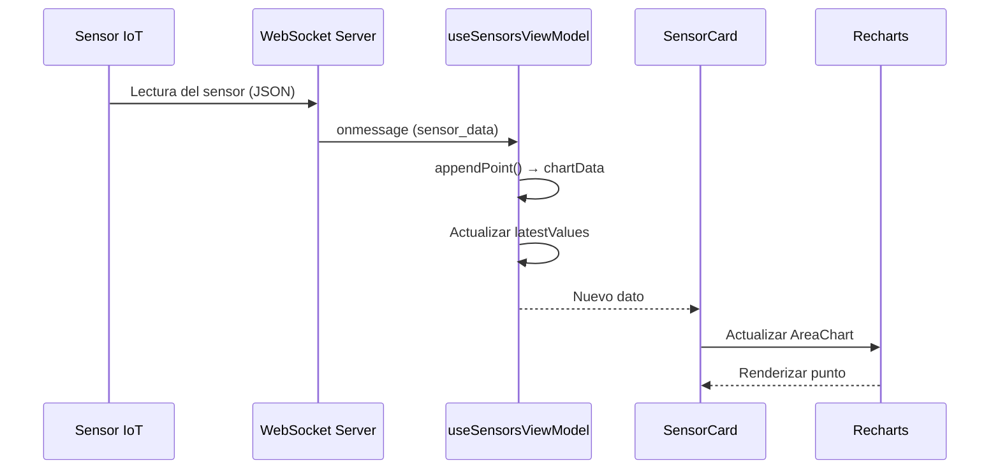
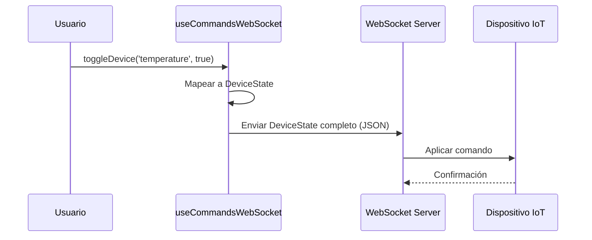

# Módulo de Sensores (`sensors`)

Monitoreo en tiempo real de sensores IoT con gráficas, control de dispositivos y gestión de circuitos.

---

## Descripción

El módulo `sensors` provee visualización en tiempo real de 6 tipos de sensores (pH, temperatura, turbidez, conductividad, alcohol, RPM) conectados vía WebSocket. También permite controlar dispositivos (motor, bomba) y activar/desactivar sensores individualmente.

---

## Estructura

```
features/sensors/
├── data/
│   ├── api/
│   │   ├── sensorApi.ts                   # Endpoints REST + WebSocket de datos
│   │   └── commandsWebSocket.ts           # WebSocket de comandos de dispositivo
│   └── repositories/
│       └── SensorRepositoryImpl.ts
├── domain/
│   ├── models/
│   │   ├── BackendSensorType.ts
│   │   ├── SensorKey.ts
│   │   ├── SensorMeta.ts
│   │   ├── SensorReading.ts
│   │   ├── SensorChartData.ts
│   │   ├── SensorToggleState.ts
│   │   ├── ChartPoint.ts
│   │   ├── DeviceState.ts
│   │   ├── WSMessage.ts
│   │   ├── WSSensorDataMessage.ts
│   │   └── WSSensorDeactivatedMessage.ts
│   ├── dtos/response/
│   │   └── sensor-history.response.ts
│   ├── repositories/
│   │   └── SensorRepository.ts
│   ├── constants/
│   │   ├── sensor-meta.constants.ts
│   │   ├── sensor-toggle-defaults.constants.ts
│   │   ├── sensor-key-to-command.constants.ts
│   │   └── default-device-state.constants.ts
│   └── usecases/
│       ├── get-sensor-history.usecase.ts
│       ├── get-latest-sensor.usecase.ts
│       └── toggle-sensor.usecase.ts
└── presentation/
    ├── view/
    │   └── SensorsView.tsx
    ├── viewmodels/
    │   └── useSensorsViewModel.ts
    ├── hooks/
    │   └── useCommandsWebSocket.ts
    ├── components/
    │   ├── SensorCard.tsx
    │   ├── WsIndicator.tsx
    │   ├── LatestBadge.tsx
    │   ├── CircuitInput.tsx
    │   └── ChartTooltip.tsx
    ├── types/
    │   └── *.types.ts
    ├── constants/
    │   ├── ws-status-config.constants.ts
    │   ├── sensors-styles.constants.ts
    │   └── chart.constants.ts
    └── utils/
        ├── format-time.ts
        └── empty-chart-data.ts
```

---

## API Endpoints (REST)

| Método | Endpoint | Parámetros | Respuesta | Descripción |
|---|---|---|---|---|
| `GET` | `/sensors/{circuitId}/{sensorType}/history` | Query: `session_id?`, `from_dt?`, `to_dt?` | `SensorHistoryResponse` | Histórico de lecturas |
| `GET` | `/sensors/{circuitId}/{sensorType}/latest` | — | `SensorReading \| null` | Última lectura |
| `POST` | `/circuits/{circuitId}/sensors/{sensorType}/toggle` | Body: `{ active: boolean }` | `void` | Activar/desactivar sensor |

---

## Conexiones WebSocket

### WebSocket A: Stream de datos de sensores

| Propiedad | Valor |
|---|---|
| URL | `{WS_BASE}/ws/sensors/{circuitId}` |
| Dirección | Server → Client (read-only) |
| Mensajes | `sensor_data`, `sensor_deactivated` |

**Mensaje `sensor_data`:**

```json
{
  "type": "sensor_data",
  "circuit_id": 1,
  "sensor_type": "temperature",
  "value": 25.3,
  "session_id": 1,
  "timestamp": "2026-07-21T00:15:00Z"
}
```

**Mensaje `sensor_deactivated`:**

```json
{
  "type": "sensor_deactivated",
  "circuit_id": 1,
  "sensor_type": "ph",
  "session_id": 1,
  "deactivated_at": "2026-07-21T00:20:00Z"
}
```

### WebSocket B: Comandos de dispositivo

| Propiedad | Valor |
|---|---|
| URL | `{WS_BASE}/ws/circuit/{circuitId}/commands` |
| Dirección | Client → Server (write-only) |
| Mensaje | `DeviceState` completo en JSON |

**`DeviceState`:**

```json
{
  "motor": "encendido",
  "bomba": "apagado",
  "sensor_temperatura": "encendido",
  "sensor_ph": "encendido",
  "sensor_alcohol": "apagado",
  "sensor_conductividad": "encendido",
  "sensor_turbidez": "encendido"
}
```

---

## Modelos de dominio

### Tipos de sensor

| Tipo backend | Key de UI | Unidad | Color |
|---|---|---|---|
| `temperature` | `temperature` | °C | `#F59E0B` (amber) |
| `alcohol` | `alcohol` | %v/v | `#22C55E` (green) |
| `conductivity` | `conductivity` | mS/cm | `#3B82F6` (blue) |
| `turbidity` | `turbidity` | NTU | `#A78BFA` (purple) |
| `ph` | `ph` | pH | `#EC4899` (pink) |
| `rpm` | `rpm` | rpm | `#06B6D4` (cyan) |
| — | `pump` | — | *(solo control, sin gráfica)* |

### `SensorReading`

```typescript
interface SensorReading {
  id:          number
  circuit_id:  number
  sensor_type: BackendSensorType
  value:       number
  session_id:  number | null
  timestamp:   string
}
```

### `ChartPoint`

```typescript
interface ChartPoint {
  time:  string    // HH:MM:SS
  value: number
}
```

### `DeviceState`

```typescript
interface DeviceState {
  motor:                 'encendido' | 'apagado'
  bomba:                 'encendido' | 'apagado'
  sensor_temperatura:    'encendido' | 'apagado'
  sensor_ph:             'encendido' | 'apagado'
  sensor_alcohol:        'encendido' | 'apagado'
  sensor_conductividad:  'encendido' | 'apagado'
  sensor_turbidez:       'encendido' | 'apagado'
}
```

---

## Flujo de datos en tiempo real



---

## Flujo de comandos



---

## Vistas y componentes

### `SensorsView` — Página principal

- Ruta: `/grafics` (autenticado)
- Header con código de circuito, cantidad de sensores activos, estado de fermentación
- Indicador de estado WebSocket (`WsIndicator`)
- Grid 2 columnas de `SensorCard` para los 6 sensores
- Auto-conecta al circuito del usuario al cargar

### `SensorCard` — Tarjeta de sensor

- Gráfica `AreaChart` (Recharts) con datos en tiempo real
- Badge con último valor (`LatestBadge`)
- Dot pulsante con color del sensor
- Contador de lecturas
- `isAnimationActive={false}` para rendimiento en tiempo real
- Placeholder "Sin datos aún" cuando no hay datos

### `WsIndicator` — Indicador de conexión

- Dot pulsante + label del estado: "En vivo", "Conectando...", "Desconectado", "Error WS"

### `CircuitInput` — Input de circuito

- Input numérico + botón "Conectar" para cambiar de circuito manualmente

---

## ViewModel (`useSensorsViewModel`)

### Estado

| Campo | Tipo | Descripción |
|---|---|---|
| `circuitId` | `number` | Circuito activo |
| `wsStatus` | `WsStatus` | Estado de la conexión WebSocket |
| `chartData` | `SensorChartData` | Datos de gráfica por sensor (máx 50 puntos) |
| `latestValues` | `Partial<Record<BackendSensorType, number>>` | Último valor por sensor |
| `loading` | `boolean` | Cargando histórico |
| `error` | `string \| null` | Mensaje de error |

### Acciones

| Acción | Descripción |
|---|---|
| `applyCircuit(id, sessionId?)` | Cambia de circuito: resetea datos, carga histórico, abre WebSocket |
| `connectWs(id)` | Abre WebSocket de datos |
| `disconnectWs()` | Cierra WebSocket |
| `loadHistory(id, sessionId?)` | Carga histórico de los 6 sensores en paralelo |

---

## `useCommandsWebSocket`

Hook separado para enviar comandos de control de dispositivos.

| Acción | Descripción |
|---|---|
| `connect(circuitId)` | Abre WebSocket de comandos |
| `disconnect()` | Cierra WebSocket |
| `toggleDevice(key, active)` | Activa/desactiva un sensor o dispositivo |
| `sendAllOn()` | Enciende todos los dispositivos |
| `sendAllOff()` | Apaga todos los dispositivos |

**Nota:** Si el WebSocket no está abierto cuando se envía un comando, se encola en `pendingRef` y se envía al conectar.

---

## Constantes clave

| Constante | Valor |
|---|---|
| `MAX_CHART_POINTS` | 50 (ventana deslizante de datos en gráfica) |
| `DEFAULT_STATE` | Todos los dispositivos en `'apagado'` |
| `ALL_SENSORS_ON` | Todos los toggles en `true` |
| `ALL_SENSORS_OFF` | Todos los toggles en `false` |

---

## Integración con otros módulos

| Módulo | Relación |
|---|---|
| `fermentation` | `useFermentation()` provee `sessionId` y estado de fermentación |
| `core/hooks/userAuth` | `useUserAuth()` provee `circuit_id` y `activation_code` |
| `core/network/createSocketClient` | Fábrica de clientes WebSocket |
