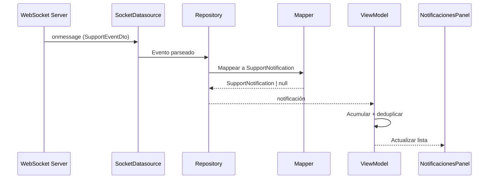

# Módulo de Soporte (`support`)

Panel administrativo de soporte técnico: gestión de tickets/chat, clientes, fermentadores, componentes, notificaciones y comunicados.

---

## Descripción

El módulo `support` es un panel completo para el equipo de soporte de Nich-Ká. Permite gestionar conversaciones de soporte en tiempo real, administrar clientes (usuarios admin), inventario de fermentadores, catálogo de componentes electrónicos, centro de notificaciones y tablón de comunicados.

---

## Estructura

```
features/support/
├── data/
│   ├── api/
│   │   ├── adminsApi.ts
│   │   ├── circuitsApi.ts
│   │   └── fermentadoresApi.ts
│   ├── datasources/
│   │   └── SupportNotificationsSocketDatasource.ts
│   ├── dto/
│   │   └── support-notification.dto.ts
│   ├── mappers/
│   │   └── support-notification.mapper.ts
│   └── repositories/
│       └── SupportNotificationsRepositoryImpl.ts
├── domain/
│   ├── models/
│   │   ├── Admin.ts
│   │   ├── Fermentador.ts
│   │   └── SupportNotification.ts
│   ├── repositories/
│   │   └── SupportNotificationsRepository.ts
│   └── usecases/
│       ├── connect-support-notifications.usecase.ts
│       ├── disconnect-support-notifications.usecase.ts
│       └── listen-support-notifications.usecase.ts
└── presentation/
    ├── view/
    │   └── SupportView.tsx
    ├── components/
    │   ├── SupportSidebar.tsx
    │   ├── TicketsPanel.tsx
    │   ├── ClientsPanel.tsx
    │   ├── FermentadoresPanel.tsx
    │   ├── ComponentsPanel.tsx
    │   ├── CodesPanel.tsx
    │   ├── NotificacionesPanel.tsx
    │   ├── AnunciosPanel.tsx
    │   ├── ProfilePanel.tsx
    │   ├── ResponsableAvatar.tsx
    │   └── LabelBadge.tsx
    ├── viewmodels/
    │   ├── useSupportNotificationsViewModel.ts
    │   ├── useFermentadoresViewModel.ts
    │   ├── useAdminsViewModel.ts
    │   └── useAnunciosPanelViewModel.tsx
    ├── types/
    │   └── *.types.ts
    ├── constants/
    │   └── *.constants.ts
    └── utils/
        └── *.ts
```

---

## API Endpoints

### REST

| Método | Endpoint | Descripción |
|---|---|---|
| `GET` | `/support/admins` | Listar administradores |
| `GET` | `/fermentadores/` | Listar fermentadores |
| `POST` | `/fermentadores/` | Registrar fermentador |
| `PATCH` | `/fermentadores/{id}` | Actualizar fermentador |
| `POST` | `/circuits/` | Registrar circuito |

### WebSocket

| Canal | Propósito |
|---|---|
| `/ws/support-chat` | Stream de notificaciones de soporte en tiempo real |

**Eventos recibidos:**

| Evento | Descripción |
|---|---|
| `message:new` | Nuevo mensaje en conversación |
| `conversation:new` | Nueva conversación de soporte (solo rol `soporte`) |
| `read` | Acuse de lectura (ignorado) |
| `typing` | Indicador de escritura (ignorado) |

---

## Modelo de datos

### `Admin`

```typescript
interface Admin {
  id: number
  name: string
  last_name: string
  email: string
  role: AdminRole       // { id, name }
  circuit: AdminCircuit // { id, code, has_circuit }
  auth_provider: string
  profile_image: string | null
  phone: AdminPhone     // { dial_code, number }
  created_at: string | null
}
```

### `Fermentador`

```typescript
type FermentadorEstado = 'disponible' | 'asignado' | 'inactivo'

interface Fermentador {
  id: number
  serial: string
  circuit_id: number | null
  codigo: string | null
  vendido: boolean
  estado: FermentadorEstado
  cliente_id: number | null
  cliente_nombre: string | null
  alta_por: string | null
  created_at: string | null
}
```

### `SupportNotification`

```typescript
type SupportNotificationKind = 'new_message' | 'new_ticket'

interface SupportNotification {
  id: string
  kind: SupportNotificationKind
  title: string
  description: string
  conversationId: number | null
  createdAt: string
  read: boolean
}
```

---

## Paneles del dashboard

### `SupportView` — Layout principal

Ruta: `/support/*` (solo rol `soporte`)

```
/sidebar          /chats          /usuarios        /fermentadores
                  /componentes    /notificaciones  /comunicados
                  /perfil
```

### Panel de Tickets (`TicketsPanel`)

- Tabla filtrable/buscable/paginada de conversaciones de soporte
- Columnas: Admin, Email, Último mensaje, Estado (Pendiente/Respondido), Fecha
- Click en "Responder" → drawer de chat deslizante (480px)
- Mensajes con burbujas alineadas (soporte = derecha/azul, admin = izquierda/oscura)
- Soporte de archivos adjuntos (imágenes inline, otros como descarga)
- Indicador de escritura con dots animados
- Filtros: Todos, Pendientes, Respondidos

### Panel de Clientes (`ClientsPanel`)

- Tabla de usuarios administradores
- Columnas: Admin (avatar + nombre), Email, Teléfono, Código de circuito, Fecha de registro
- Búsqueda por nombre/email
- Drawer de detalle con info completa del admin
- Estadísticas: total admins, cantidad con circuitos

### Panel de Fermentadores (`FermentadoresPanel`)

- Tabla de inventario de fermentadores
- Columnas: Serial, Código, Vendido (toggle), Estado (dropdown), Alta por, Detalle
- Cambios inline: toggle vendido, cambio de estado vía dropdown
- Modal para registrar nuevo fermentador (muestra serial + código)
- Drawer de detalle con código de activación copiable
- Estadísticas: vendidos, asignados, en inventario

### Panel de Componentes (`ComponentsPanel`)

- Grid de catálogo de componentes electrónicos
- Columnas: Nombre + descripción, SKU, Precio (MXN), Stock, Acciones
- CRUD completo: crear, editar (modal), eliminar (confirmación)
- Búsqueda por nombre, SKU o descripción

### Panel de Códigos (`CodesPanel`)

- Generación de códigos de activación para usuarios sin código
- Lista de códigos generados: Código, Usuario asignado, Fecha, Estado
- Copy-to-clipboard por código
- Estadísticas: generados, asignados, sin código

### Panel de Notificaciones (`NotificacionesPanel`)

- Centro de notificaciones en tiempo real
- Filtrado: Todas / Sin leer
- Cada notificación: ícono, título, descripción, badge de tipo, "hace X tiempo"
- Botón "Marcar leída" en hover
- Botón "Marcar todas como leídas"
- Paginación (10 por página)

### Panel de Anuncios (`AnunciosPanel`)

- CRUD completo de anuncios/comunicados
- Labels: NUEVO, MEJORA, AVISO, CRITICO (con colores)
- Formulario de creación: label, versión, fecha, título, descripción + vista previa
- Lista de cards con borde coloreado por label
- Drawer de detalle con gestión de pin (1d / 7d / 30d / indefinido)
- Edición inline en drawer
- Eliminación con confirmación

### Panel de Perfil (`ProfilePanel`)

- Información del usuario de soporte
- Edición de datos personales (nombre, apellido, email, teléfono)
- Activación de circuito (si no tiene uno)
- Cambio de contraseña

---

## Notificaciones en tiempo real

### Flujo



### Mapeo de eventos

| Evento WebSocket | Rol viewer | Notificación generada |
|---|---|---|
| `message:new` (rol distinto) | Cualquier rol | `new_message` |
| `conversation:new` | `soporte` | `new_ticket` |
| `message:new` (mismo rol) | — | Filtrado (null) |
| `read` / `typing` | — | Ignorado (null) |

---

## Dependencias cross-feature

| Módulo | Uso |
|---|---|
| `support-chat` | `useSupportAgentViewModel` — lista de conversaciones, mensajes, envío de respuestas |
| `components` | `useComponentsViewModel`, `ComponentFormModal` — CRUD de componentes |
| `announcements` | `AnnouncementsRepositoryImpl` + 6 use cases — CRUD de anuncios |
| `profile` | `useProfileViewModel`, `PhoneInput` — edición de perfil |
| `core/store` | `useSupportStore`, `useSupportClientsStore` — estado global |

---

## Constantes clave

| Constante | Contenido |
|---|---|
| `SIDEBAR_ITEMS` | 6 items de navegación del sidebar |
| `ROLE_LABELS` | Mapeo de roles a labels en español |
| `ROLE_COLOR` | Colores por rol |
| `NOTIF_TIPO_STYLE` | Estilos por tipo de notificación |
| `ANNOUNCEMENT_LABEL_COLORS` | NUEVO=#22C55E, MEJORA=#3B82F6, AVISO=#F59E0B, CRITICO=#F43F5E |
| `PAGE_SIZE` | 10 (paginación en todos los paneles) |
